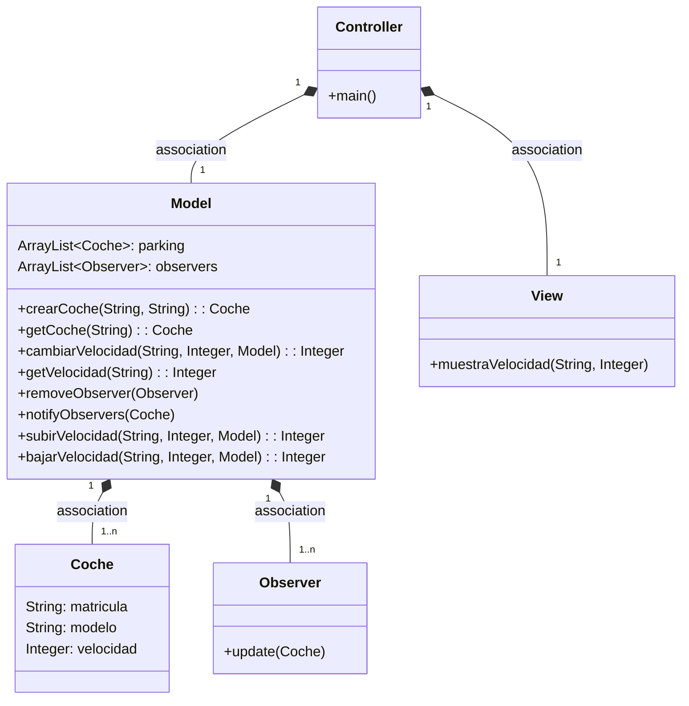
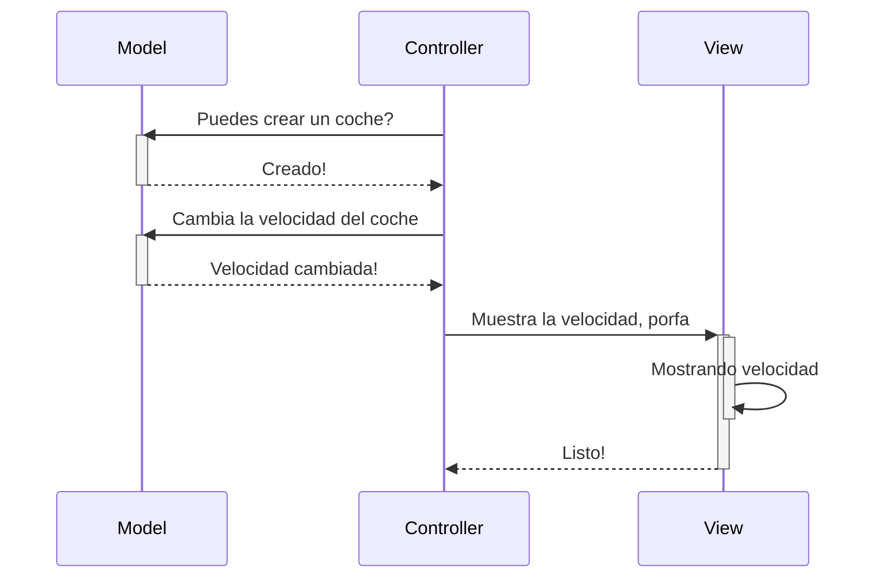

# Tarea: arquitectura MVC

EXAMEN FINAL 3º TRIMESTRE
Arquitectura MVC

`Aqui estan el diagrama de clases y el diagrama de secuencia del programa.`

---

### Diagrama de clases:

---

### Diagrama de Secuencia
